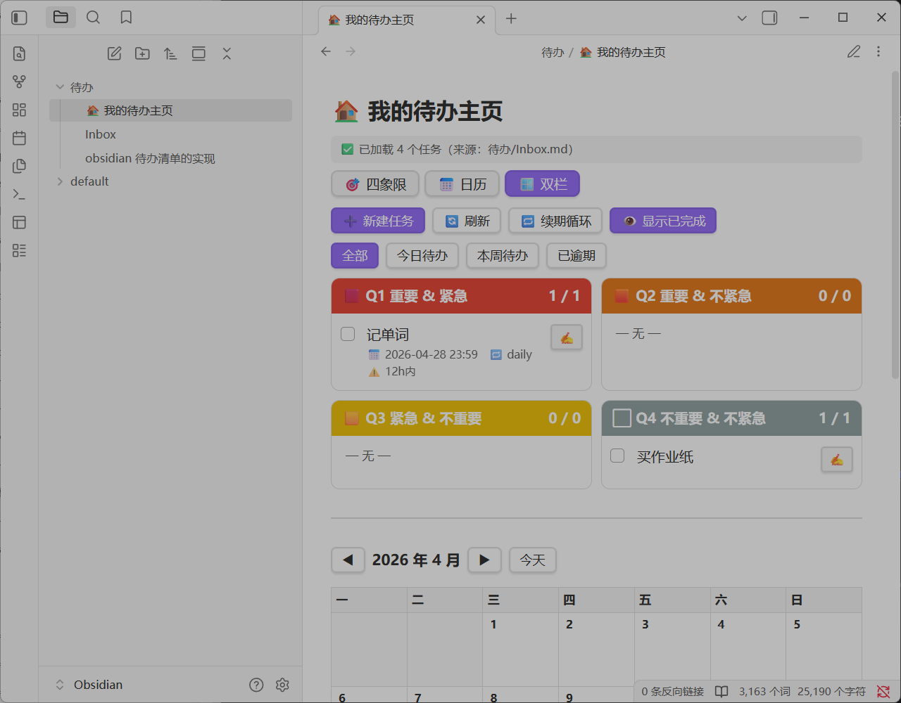

# 效果如上图
/* ============================================================
# 全平台可用
## 一体化主页：四象限 + 日历 + 弹窗表单 + 拖拽 + 过滤
## 依赖：仅 Dataview（启用 JavaScript Queries）
   ============================================================ */
---
## 一个四象限任务清单
- 按照重要程度和紧急程度两个维度来进行事项的分类
- 可重复使用
- 可自动在四象限上更新事项
- 简单添加任务：​只用在一个文件里添加事项
- 在添加事项时，​只需要在事项后勾选分别重要和紧急的复选框自动更新到对应象限
- 可添加循环任务
- 可在四象限上勾选复选框表示完成
- 显示时间：​添加时间，​截止时间，​完成时间
- 未完成的事项在对应维度可自动排序，​离截止时间越近的排前面
- 当某一事项截止时间不足12小时自动将其设为紧急
- 修改事项不等于添加新事项
- 已完成的任务自动排序到未完成任务下方

## 日历功能
- 添加一个日历
- 日历自动更新
- 日历默认显示当前月份
- 日历上显示事项
- 不同象限的事项用不同的颜色显示
- 添加事项后，​在添加当天的日历上以「​Start· 为前缀显示该事项
- 添加事项后，​在截至当天的日历上以 End」· 为前缀显示该事项
- 完成事项后，​在完成当天的日历上以 ✅· 为前缀显示该事项
- 修改事项后，​在修改当天的日历上以 ✍️· 为前缀显示该事项
- 可在日历上添加待办事项
---
请把代码顶部这一行改成你实际的路径：

`const SRC_PATH = "待办/Inbox.md";`

/* ⚠️ 改成你 Inbox.md 的实际路径（含文件夹）⚠️
   例：根目录就放 "Inbox.md"
   在 待办 文件夹下就 "待办/Inbox.md" */

如果不确定路径：

    在 Obsidian 中右键 Inbox 文件 → 复制 Vault 内路径
    或者直接试常见的：
        Inbox.md（根目录）
        待办/Inbox.md
        Todo/Inbox.md

